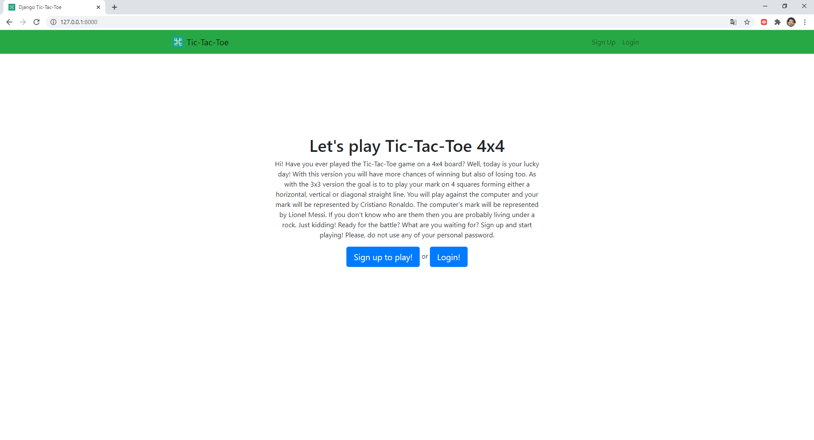
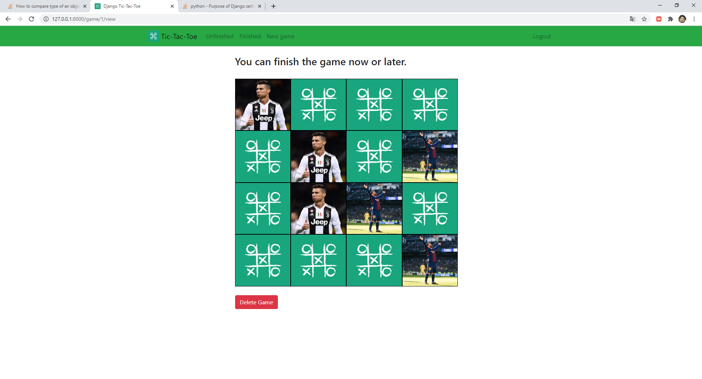
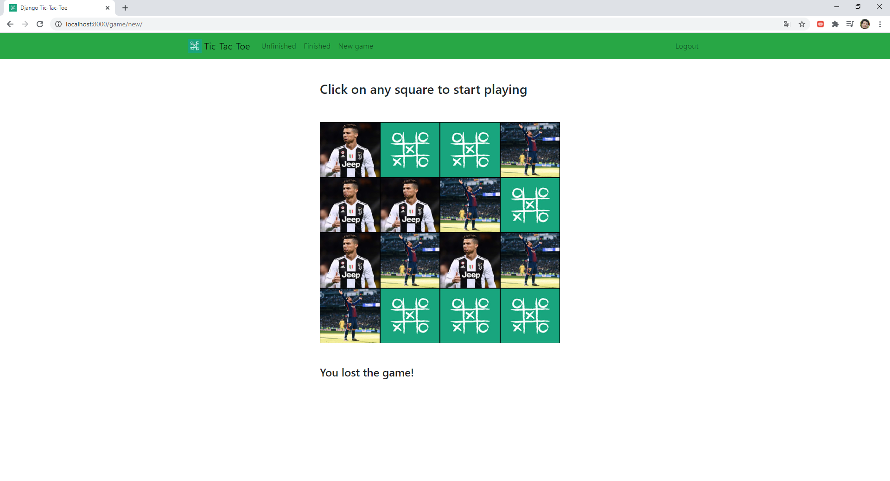
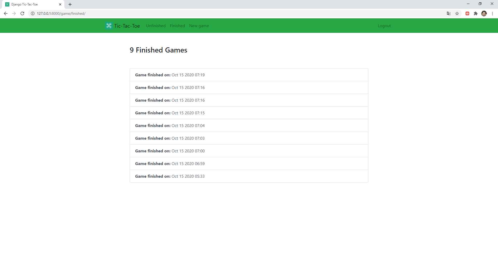
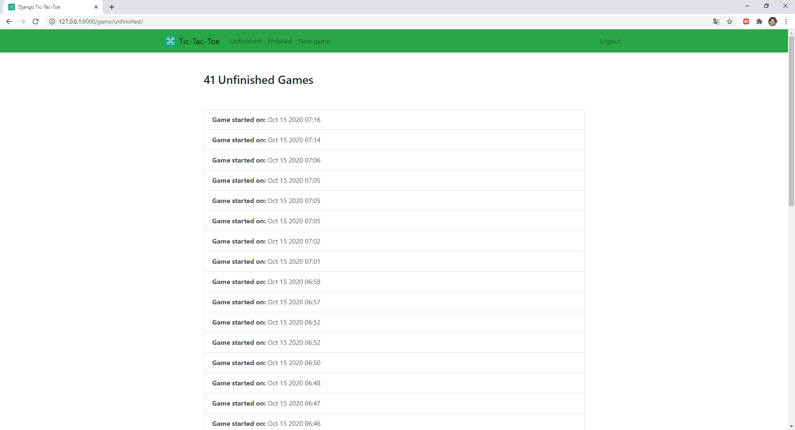
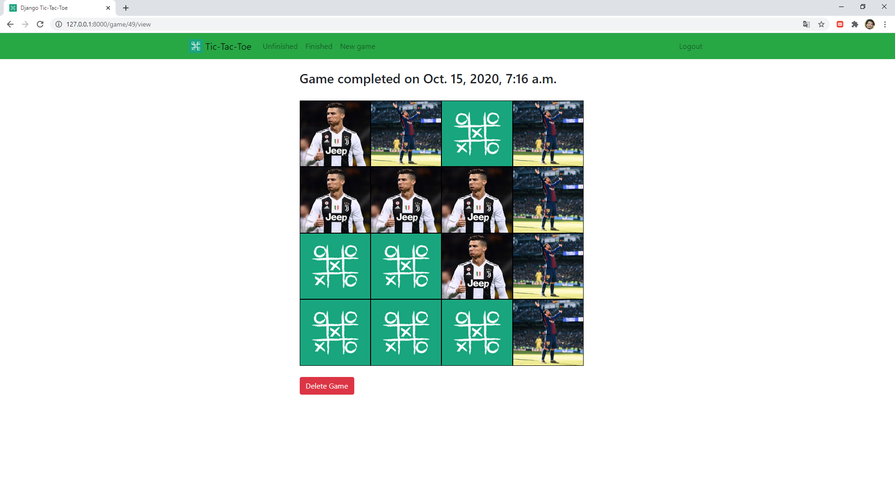
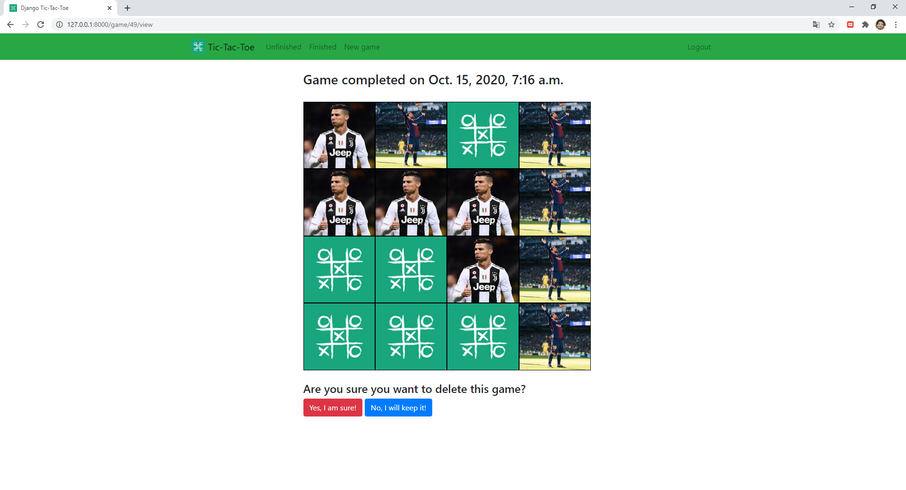

Hi! Have you ever played the Tic-Tac-Toe game on a 4x4 board? If you haven't you are not alone. With this version you will have more chances of winning but also of losing too. As with the 3x3 version the goal is to to play your mark on 4 squares forming either a horizontal, vertical or diagonal straight line. You will play against the computer and your mark will be represented by Cristiano Ronaldo. The computer's mark will be represented by Lionel Messi. If you don't know who are them then you are probably living under a rock. Just kidding! I developed this game with Python, Django, Jquery, ES6 and Bootstrap. The computer's moves are determined on the Django server. 

Happy 4x4 Tic-Tac-Toe!